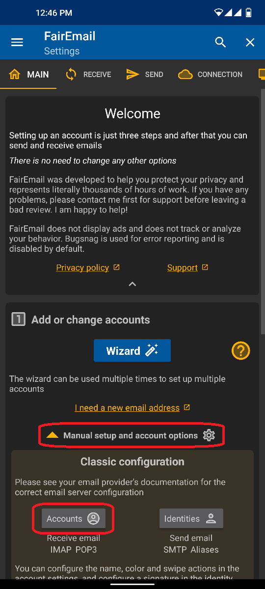
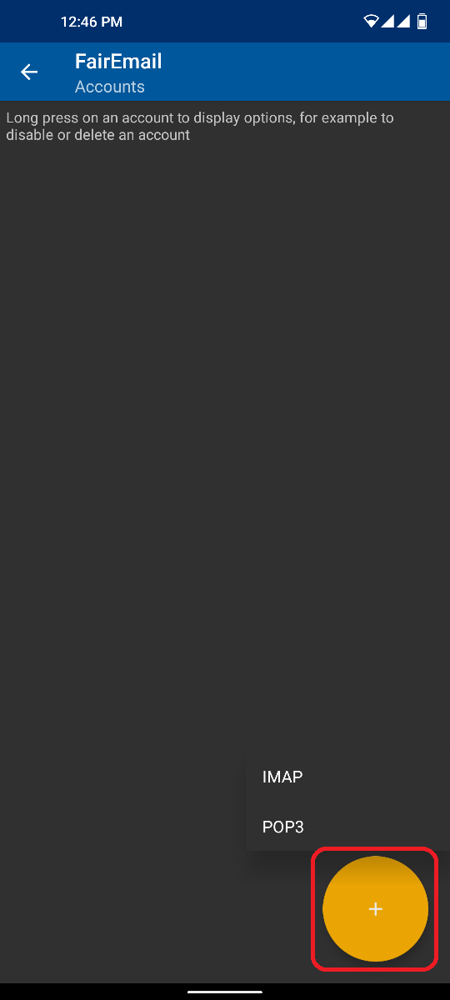

# Manual configuration

**NOTE:** If you have any troubles, check [this extensive FAQ](https://github.com/M66B/FairEmail/blob/master/FAQ.md).
You may also ask in [this XDA Forum thread](https://forum.xda-developers.com/t/app-5-0-fairemail-fully-featured-open-source-privacy-oriented-email-app.3824168/)
or via [this contact form](https://contact.faircode.eu/?product=fairemailsupport). Bad reviews won't help you or the developer, so try asking in person first.

**NOTE:** In most cases, an automatic configuration via the wizard described in the [first configuration guide](first-config.md) should work right away. If you are using a custom domain & server and the wizard doesn't work as expected, you can enable automatic configuration by implementing [RFC 6186](https://datatracker.ietf.org/doc/html/rfc6186) within the DNS and / or [Thunderbird:Autoconfiguration](https://wiki.mozilla.org/Thunderbird:Autoconfiguration). An independent guide for both methods can be found in [Auto Discover | LD Documentation](https://doc.ld-online.net/e-mail/auto-discover).

## Accounts & identities

**Accounts** are basically your IMAP and POP3 accounts for reading mails. FairEmail uses your account to fetch _incoming_ mails.

**Identities** are SMTP accounts for sending mails. FairEmail will use the identity to send _outgoing_ mails.

## Adding a new email account

**NOTE:** This step requires working internet connection.

Adding a new email account (account + identity) is pretty straightforward. Just follow these steps:

1. Open the "Main" settings
2. Click on "Manual setup and account options" below the wizard
3. Press the "Accounts" button
4. Click on the "+" icon to add a new account
5. Select your provider or "custom"
6. Enter your account credentials and modify the server name & port, if necessary
7. Press the "Check" button
8. Check the recognized default folders
9. Save with "Add related identity" enabled
10. Enter the Identity details (e.g. the FROM name and address)

Here are some screenshots to help you visualize these steps:

Thanks @[mkasimd](https://github.com/mkasimd/) for contributing this documentation.
